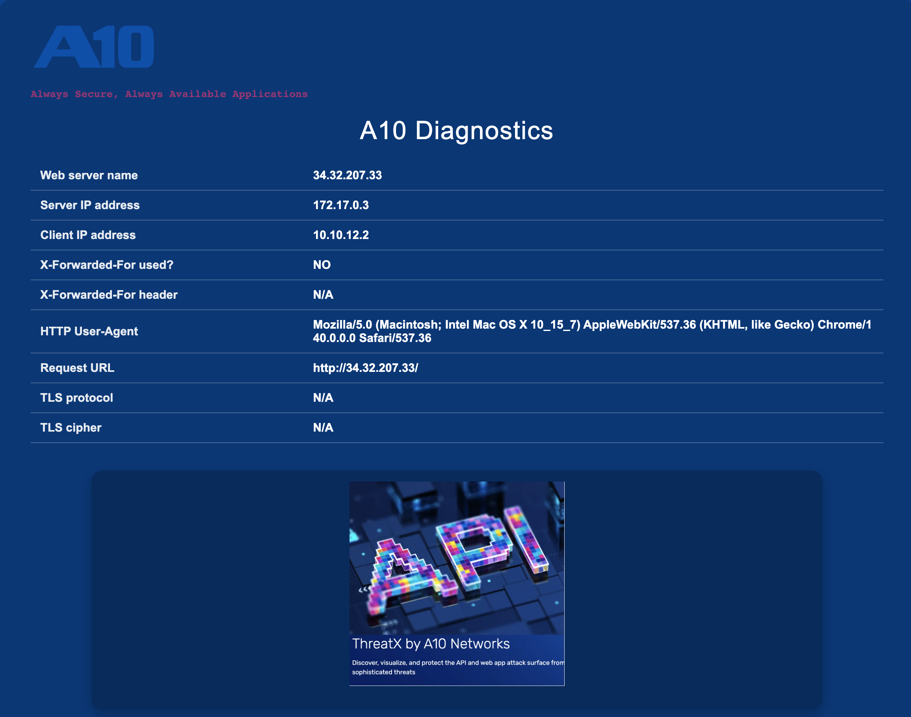

# A10 Demo Container Web App
A lightweight A10 Networks demo container running Apache 2 + PHP 8.2.
Shows live request & header info on an A10 branded diagnostics page, perfect for validating ADC behavior, VIPs, X-Forwarded-For, host headers, and now HTTPS/TLS details.

--------
Features
--------
✅ Apache 2 + PHP 8.2 runtime

✅ Displays web-server & client details

✅ Detects and shows X-Forwarded-For (incl. header value)

✅ HTTPS (443) support with self-signed fallback

✅ Diagnostics show TLS protocol & cipher (when HTTPS terminates here or via proxy headers)

✅ Dynamic background color via env var

✅ Rotating slideshow with A10-themed images

✅ Ready for labs, demos, and cloud

{width="60%" .center-image}

-----------------
Where to Download?
-----------------
The A10 Demo Container Web App can be downloaded from Docker Hub by following the link: <https://hub.docker.com/repository/docker/gwolfis/a10-aadc-demo>

-----------
Quick Start
-----------
Run it directly from Docker Hub:

```bash
docker run -d \
  --restart unless-stopped \
  -p 80:80 \
  -p 443:443 \
  -e BG_COLOR="#004A9F" \
  --name a10-aadc-demo \
  gwolfis/a10-aadc-demo:latest
```

Open:

* HTTP: http://localhost

* HTTPS: https://localhost (self-signed → proceed in browser or use curl -k)

--------------------
HTTPS / Certificates
--------------------

By default, the container generates a self-signed cert at startup.
To use your own certs, mount them:

```bash
docker run -d \
  --restart unless-stopped \
  -p 80:80 -p 443:443 \
  -v $(pwd)/certs/server.crt:/etc/apache2/ssl/server.crt:ro \
  -v $(pwd)/certs/server.key:/etc/apache2/ssl/server.key:ro \
  gwolfis/a10-aadc-demo:latest
```
The diagnostics page will display TLS protocol and cipher.

------------------------
Color Options (BG_COLOR)
------------------------

Change the background color to match your environment or theme.

| Theme         | Hex       |
| ------------- | --------- |
| A10 Dark Blue | `#004A9F` |
| A10 Orange    | `#D93B0A` |
| A10 Pink      | `#CA0A86` |
| A10 Mid Blue  | `#0541A8` |
| A10 Purple    | `#340087` |
| A10 Green     | `#107746` |


Example:
BG_COLOR="#CA0A86" docker run -d -p 80:80 -p 443:443 gwolfis/a10-aadc-demo # (use sudo if needed)

----------------------
Docker Compose Example
----------------------

```yml
services:
  a10-aadc-demo:
    image: gwolfis/a10-aadc-demo:latest
    container_name: a10-aadc-demo
    ports:
      - "80:80"
      - "443:443"
    environment:
      BG_COLOR: ${BG_COLOR:-#004A9F}
    # Optional: mount your own TLS certs instead of self-signed
    # volumes:
    #   - ./certs/server.crt:/etc/apache2/ssl/server.crt:ro
    #   - ./certs/server.key:/etc/apache2/ssl/server.key:ro
    restart: unless-stopped
```

Run with a specific color:
BG_COLOR="#340087" docker compose up -d

Build Locally (Optional)
------------------------

git clone https://github.com/gwolfis/a10-aadc-demo.git
cd a10-aadc-demo
docker build -t gwolfis/a10-aadc-demo .

-------------------
Directory Structure
-------------------
```pgsql
index.php            → A10 diagnostics page
images/              → A10 logos and slideshow images
Dockerfile           → Apache + PHP build definition
docker-compose.yml   → Optional runtime configuration
```

----------
DISCLAIMER
----------

This project is an educational and demonstration container for showcasing A10 Networks concepts (GSLB, WAF, XFF handling, VIP testing).
It does not include official A10 software or support.


